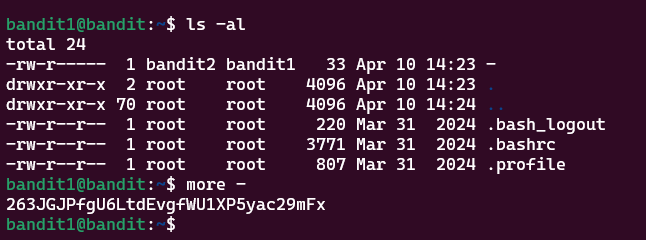

# Bandit Level 1 > 2

## Description:
The password for the next level is stored in a file called ```-``` located in the home directory.

## Tips to help to solve this Level:
ls, cd, cat, file, du, find

## Solution:
To pass this level you have to open a dashed filename. To open a dashed filename you have to specify the full location of the file such as ```./-``` or an alternative is ```more -```


