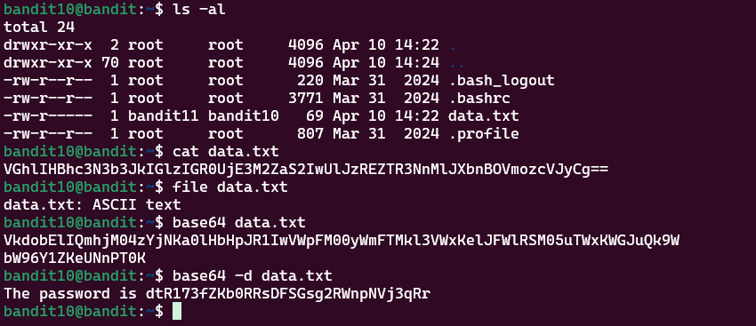

# Bandit Level 10 > 11 

## Description:
The password for the next level is stored in the file data.txt, which contains base64 encoded data.

## Tips to help to solve this Level:
grep, sort, uniq, strings, base64, tr, tar, gzip, bzip2, xxd

## Solution:

1. Identify the task:

    I needed to decrypt a password that was base64 encoded in a text file.

2. Initial attempt (incorrect):

    I first tried:

```bash
base64 filename.txt
```

But this actually encoded the password again instead of decrypting it.

3. Correct way — decrypt instead of encrypt:

    To decrypt the password, I used:

```bash
base64 -d filename.txt
```

4. Tip — watch out for double-encoding:

If you accidentally encoded it again, you would need to decrypt twice to get back to the plain password.

