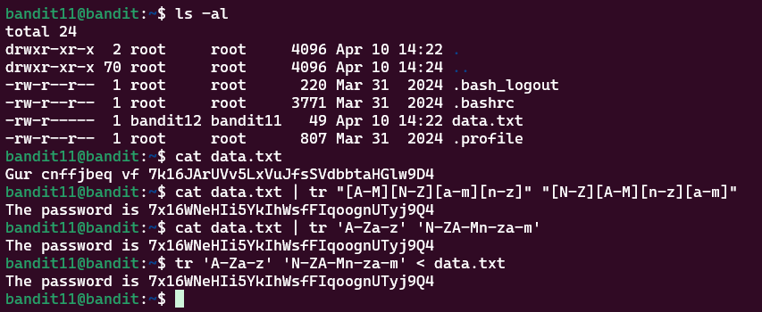

# Bandit Level 11 > 12 

## Description:
The password for the next level is stored in the file data.txt, where all lowercase (a-z) and uppercase (A-Z) letters have been rotated by 13 positions.

## Tips to help to solve this Level:
grep, sort, uniq, strings, base64, tr, tar, gzip, bzip2, xxd

## Solution:

1. Identify the task:

    I needed to decrypt or transform the text in a file.

2. Exploring commands:

    I used `man` to explore different commands and their options until I came across `tr`.

    - `tr` stands for translate — it converts or maps character sets from one to another.

3. Using tr to decrypt:

    I noticed that I could shift letters in the text with `tr`.
    
    So I used:

```bash
cat filename.txt | tr "[A-M][N-Z][a-m][n-z]" "[N-Z][A-M][n-z][a-m]"
```

    This successfully decoded the text in the file, revealing:

    “The password is …”

4. Simplifying the command (alternative way):

    I later found I could shorten it to:

```bash
cat data.txt | tr 'A-Za-z' 'N-ZA-Mn-za-m'
```
    or even:
```bash
tr 'A-Za-z' 'N-ZA-Mn-za-m' < data.txt
```



