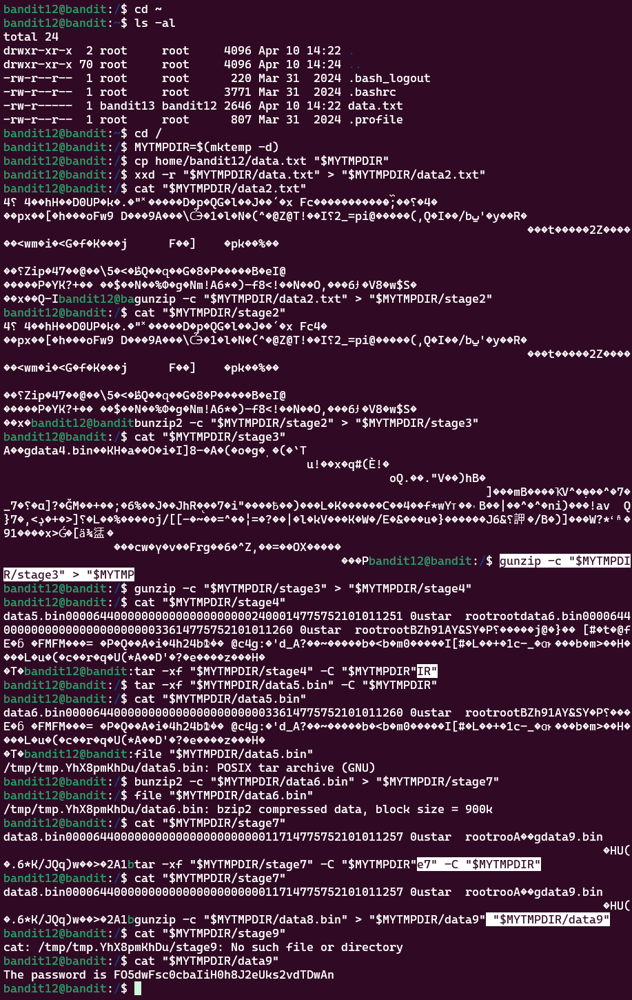

# Bandit Level 12 > 13 

## Description:
The password for the next level is stored in the file data.txt, which is a hexdump of a file that has been repeatedly compressed. For this level it may be useful to create a directory under /tmp in which you can work. Use mkdir with a hard to guess directory name. Or better, use the command “mktemp -d”. Then copy the datafile using cp, and rename it using mv (read the manpages!).

## Tips to help to solve this Level:
grep, sort, uniq, strings, base64, tr, tar, gzip, bzip2, xxd, mkdir, cp, mv, files

## Solution:

This level was **the most challenging**, taking me **5 days to solve**. 

Ultimately, the password was **contained within a file compressed multiple times with different methods**.  

Here’s how I tackled it, step by step:

1. Create a temporary directory

To avoid clutter and repeated typing of directory paths, I first created a temporary directory directly from the root directory and used a variable to store its path:

```bash
MYTMPDIR=$(mktemp -d)
```

2. Copy the initial file into the temporary directory

```bash
cp home/bandit12/data.txt "$MYTMPDIR"
```

3. Reverse the hexdump

```bash
xxd -r "$MYTMPDIR/data.txt" > "$MYTMPDIR/data2.txt"
```

4. Inspect and extract files, step by step

Using file and cat to determine compression format at each step:

Step 4a (data2.txt) — GZIP compressed:

```bash
gunzip -c "$MYTMPDIR/data2.txt" > "$MYTMPDIR/stage2"
```
Step 4b (stage2) — bzip2 compressed:

```bash
bunzip2 -c "$MYTMPDIR/stage2" > "$MYTMPDIR/stage3"
```
Step 4c (stage3) — GZIP compressed:

```bash
gunzip -c "$MYTMPDIR/stage3" > "$MYTMPDIR/stage4"
```
Step 4d (stage4) — POSIX tar archive (GNU):

```bash
tar -xf "$MYTMPDIR/stage4" -C "$MYTMPDIR"
```
Step 4e (data5.bin) — POSIX tar archive (GNU):

```bash
tar -xf "$MYTMPDIR/data5.bin" -C "$MYTMPDIR"
```
Step 4f (data6.bin) — bzip2 compressed:

```bash
bunzip2 -c "$MYTMPDIR/data6.bin" > "$MYTMPDIR/stage7"
```
Step 4g (stage7) — POSIX tar archive (GNU):

```bash
tar -xf "$MYTMPDIR/stage7" -C "$MYTMPDIR"
```
Step 4h (data8.bin) — GZIP compressed:

```bash
gunzip -c "$MYTMPDIR/data8.bin" > "$MYTMPDIR/data9"
```

5. Final Conclusion

    Checking the **contents of** `data9`:

```bash
cat "$MYTMPDIR/data9"
```
the password was **found in this file!**

