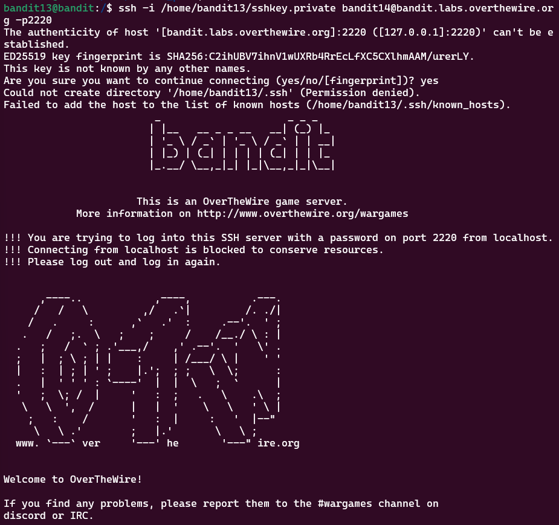

# Bandit Level 13 > 14 

## Description:
The password for the next level is stored in `/etc/bandit_pass/bandit14` and can only be read by user `bandit14`. 

For this level, you don’t get the next password, but you get a private SSH key that can be used to log into the next level. Note: localhost is a hostname that refers to the machine you are working on.

## Tips to help to solve this Level:
ssh, telnet, nc, openssl, s_client, nmap

## Solution:

This challenge was a tough one — it took me 3 days to solve — mainly due to confusion about public and private keys.

Here’s how I eventually got through it:

1. Public vs Private Keys

I initially tried to generate a public key from the private key with:

```bash
ssh-keygen -f sshkey.private -y
```

Alternatively you can view the public key directly key with:

```bash
openssl pkey -in sshkey.private -pubout
```

I was unable to write the output to a file due to permissions on the server.

2. Public Key Already Present

I later discovered (with help from a Rob Edwards and CodewithBubb YouTube video) that the public key was already present on the server — I didn't need to generate it myself.

3. Attempting SCP

I initially tried copying the private key to my local machine with `scp`, but this was blocked due to server restrictions.

4. Successful Connection

Instead, I connected directly with `SSH` from root using the private key while still on the server.

```bash
ssh -i /home/bandit13/sshkey.private bandit14@bandit.labs.overthewire.org -p2220
```
This command means:
- `-i` specifies which identity file (private key) to use
- bandit14 is the username
- The server is bandit.labs.overthewire.org with port 2220

5. Retrieve Password

Once I was logged in as `bandit14`, I was able to view the password located in:

```bash
cat /etc/bandit_pass/bandit14
```

