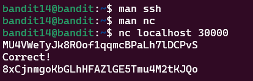

# Bandit Level 14 > 15 

## Description:
The password for the next level can be retrieved by submitting the password of the current level to port 30000 on localhost.

## Tips to help to solve this Level:
ssh, telnet, nc, openssl, s_client, nmap

## Solution:

1. Misleading Assumption

At first, I was focused on using ssh again since it was the key method in the previous level.

I even went through the man ssh pages — but it turned out to be a distraction in this case.

2 - Realizing It’s a Local Network Port

Eventually, after reading more and finding hints online, I understood the task was asking me to send the current password to a service listening on localhost (127.0.0.1) - specifically on port 30000.

3 - Using nc (Netcat) to Connect to the Port

Once I learned about `nc` (short for Netcat), the solution was straightforward:

```bash
nc localhost 30000
```

This opens a connection to port 30000 on your local machine.

4 - Enter the Current Password

After running the `nc` command, it waits for input.

Simply type or paste the password from Bandit Level 14 and hit Enter.

The server then responds with the password for Level 15.

