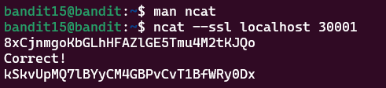

# Bandit Level 15 > 16 

## Description:
The password for the next level can be retrieved by submitting the password of the current level to port 30001 on localhost using SSL/TLS encryption.

## Tips to help to solve this Level:
ssh, telnet, nc, ncat, socat, openssl, s_client, nmap, netstat, ss

## Solution:
1. Recognize the SSL Requirement

At first, this level looked similar to Level 14, but I quickly realized that a regular nc connection wouldn’t work because:

- Port 30001 expects an SSL connection.

- Without SSL, the connection fails or returns unreadable output.

2. Explore the Manual Pages

I looked through the man pages and discovered:

- The tool `ncat` (a variant of `nc`, part of the Nmap suite)

- It supports SSL with the `--ssl` flag.

3. Use `ncat` to Connect via SSL

To connect securely, I ran:

```bash
ncat --ssl localhost 30001
```

4. Enter the Current Password

Just like before, once connected, I typed in the password from Level 15, then pressed Enter.

The server then returned the password for Level 16.

