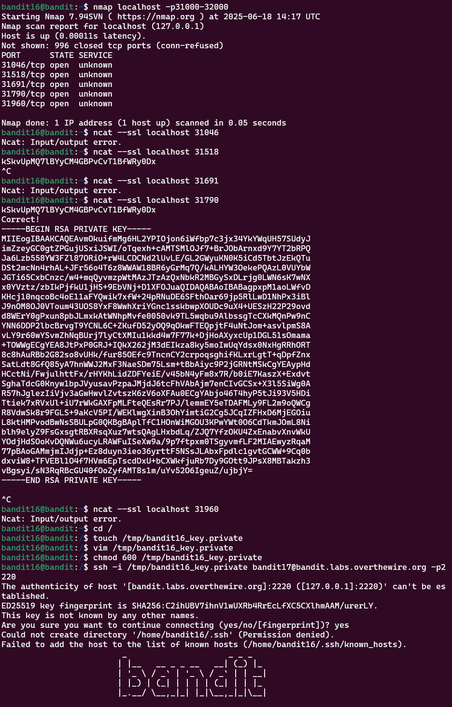

# Bandit Level 16 > 17 

## Description:
The credentials for the next level can be retrieved by submitting the password of the current level to a port on localhost in the range 31000 to 32000. First find out which of these ports have a server listening on them. Then find out which of those speak SSL/TLS and which don’t. There is only 1 server that will give the next credentials, the others will simply send back to you whatever you send to it.

## Tips to help to solve this Level:
ssh, telnet, nc, ncat, socat, openssl, s_client, nmap, netstat, ss

## Solution:

1. Discovering Port Scanning with nc

- I started by reading the manual for `nc` (Netcat), knowing it can be used for port scanning.

- I searched for relevant sections using:

```bash
man nc | grep -i "port scan"
```

- Learned that Netcat can scan single ports or ranges using the `-z` (zero-I/O mode) flag.

2. Scanning Ports with nmap (Much Easier)

Instead of `nc`, I switched to `nmap`, which gave me a faster, cleaner result:

```bash
nmap localhost -p31000-32000
```
Explanation:

- localhost: the local machine

- -p31000-32000: scan only that port range

This gave me a short list of open ports only, saving lots of time.

3. Checking for SSL Services

Next, I needed to identify which open port uses SSL.

I tested each open port using `ncat` with the `--ssl` flag like this:

```bash
ncat --ssl localhost <port>
```

Repeating this manually until one of them (port 31790) returned a private SSH key after I entered the Level 16 password.

4. Saving the Private Key Locally

- Once the private key appeared, I copied it.

- Then created a file in a temporary directory:

```bash
touch /tmp/bandit16_key.private
```
    
- Pasted the key into the file (e.g., using nano or vim in terminal).

5. Fixing File Permissions

SSH refused to use the key until it had the correct permissions. I fixed this with:

```bash
chmod 600 /tmp/bandit16_key.private
```

6. Logging in Using the Private Key

Finally, I logged into Bandit 17 using the SSH private key:

```bash
ssh -i /tmp/bandit16_key.private bandit17@bandit.labs.overthewire.org -p2220
```

This time, it successfully logged me in.


