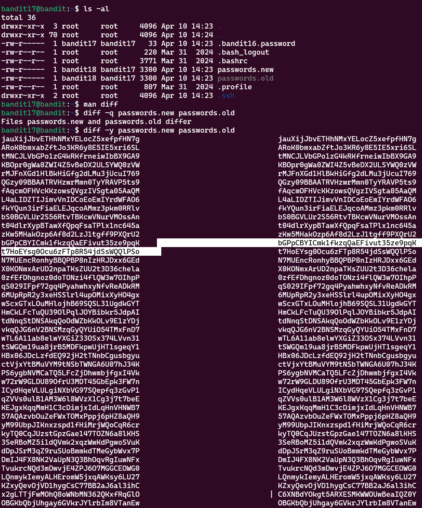

# Bandit Level 17 > 18 

## Description:
There are 2 files in the homedirectory: passwords.old and passwords.new. The password for the next level is in passwords.new and is the only line that has been changed between passwords.old and passwords.new

NOTE: if you have solved this level and see ‘Byebye!’ when trying to log into bandit18, this is related to the next level, bandit19.

## Tips to help to solve this Level:
cat, grep, ls, diff

## Solution:

1. Read the Manual for diff

To understand how to compare files, I began by checking the manual:

```bash
man diff
```

This helped me learn that `diff` is used to find differences between two files.

2. Perform a Quick File Comparison

To check if the two files had any differences, I used:

```bash
diff -q passwords.new passwords.old
```

- `-q` stands for "quiet" mode — it only reports if the files differ.

Output:

```bash
Files passwords.new and passwords.old differ
```

This confirmed that the files were not identical.

3. View Files Side by Side

To see exactly where the files differed, I used:

```bash
diff -y filename1 filename2
```

- `-y` shows the contents side-by-side, which made it much easier to visually spot differences.

The password was clearly visible in the differing line of the second file.

