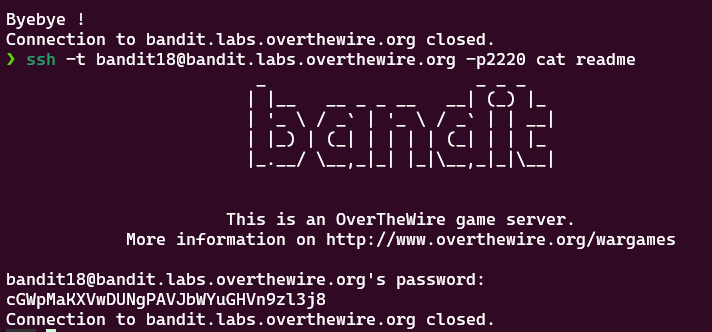

# Bandit Level 18 > 19 

## Description:
The password for the next level is stored in a file readme in the homedirectory. Unfortunately, someone has modified .bashrc to log you out when you log in with SSH.

## Tips to help to solve this Level:
ssh, ls, cat

## Solution:

1. Understand the Problem

When trying to log in with SSH:

```bash
ssh bandit18@bandit.labs.overthewire.org -p 2220
```

You are instantly logged out due to a command in the `.bashrc` file that forces logout.

At first, I mistakenly tried fixing the issue by editing `.bashrc` on my local machine, which had no effect.

2. Read the SSH Manual for Options

To figure out a workaround, I explored the `ssh` command's options by running:

```bash
man ssh
```

While reading the manual, I came across the -t option.

3. Use SSH with a Single Command Execution

Instead of opening an interactive shell (which triggers `.bashrc`), I used SSH to directly execute a command before logout occurs:

```bash
ssh -t bandit18@bandit.labs.overthewire.org -p 2220 cat readme
```

- `-t` forces pseudo-terminal allocation, which helps bypass auto-logout in some environments.

- `cat readme` runs immediately before the logout triggers.

This command printed the password for Level 19.

