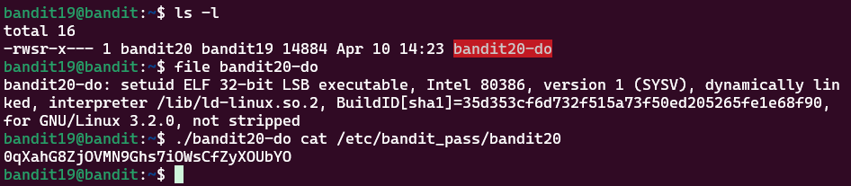

# Bandit Level 19 > 20 

## Description:
To gain access to the next level, you should use the setuid binary in the homedirectory. Execute it without arguments to find out how to use it. The password for this level can be found in the usual place (/etc/bandit_pass), after you have used the setuid binary.

## Tips to help to solve this Level:
setuid

## Solution:

1. Misinterpretation: Tried to Use setuid Manually

I initially attempted to use `setuid` or modify file permissions myself, but kept running into permission errors.

I was misunderstanding the task, assuming I needed to set `setuid` manually.

2. Carefully Re-read the Instructions

I re-read the task description:

        "You should use the setuid binary in the home directory"

This clarified that the binary was already provided and configured.

3. Identify the Setuid Binary

    I listed the files in the home directory:

```bash
ls -l
```

Output showed a file named `bandit20-do` with an `s` in the permissions (e.g. -rwsr-xr-x), meaning `setuid` is enabled.

I also ran:

```bash
file bandit20-do
```

Output:

```bash
setuid ELF 32-bit LSB executable...
```

Confirmed this is a setuid binary designed to run commands as bandit20.

4. Use the Binary to Read the Password

I used the provided binary to execute cat as bandit20:

```bash
./bandit20-do cat /etc/bandit_pass/bandit20
```

This output the password for bandit20.

