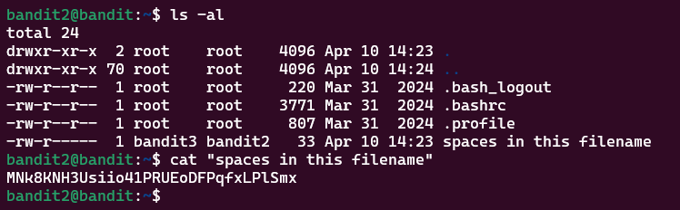

# Bandit Level 2 > 3

## Description:
The password for the next level is stored in a file called spaces in this filename located in the home directory.

## Tips to help to solve this Level:
ls, cd, cat, file, du, find

## Solution:
To pass this level you simply have to use ```double-quotes``` in order to open the file. Like the following:


