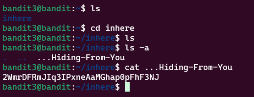

# Bandit Level 3 > 4

## Description:
The password for the next level is stored in a hidden file in the inhere directory.

## Tips to help to solve this Level:
ls, cd, cat, file, du, find

## Solution:
The tricky part here is the inhere directory is not what's hidden and thats where I got confused. When you use ```ls``` to open the ```inhere``` directory you don't see anything. 

To see the contents I used ```ls-a``` which then showed a file called ```'...Hiding-From-You'```. To open this file you can use: 

`cat ...Hiding-From-You`
or 
`vim ...Hiding-From-You` 

Both methods work.


