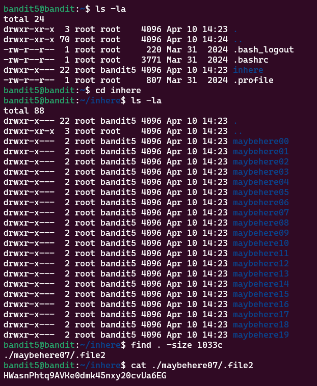

# Bandit Level 5 > 6

## Description:
The password for the next level is stored in a file somewhere under the inhere directory and has all of the following properties:

    human-readable
    1033 bytes in size
    not executable


## Tips to help to solve this Level:
ls, cd, cat, file, du, find

## Solution:
So the command I used was: 
```bash
find . -size 1033c
``` 

**Notes:**
```.``` means search from the current directory.
```c``` stands for bytes and this led me to the folder ```maybehere07``` and ```.file2```. 

This is where I found the password.

