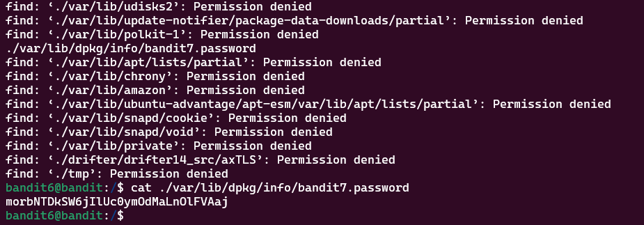

# Bandit Level 6 > 7

## Description:
The password for the next level is stored somewhere on the server and has all of the following properties:

    owned by user bandit7
    owned by group bandit6
    33 bytes in size

## Tips to help to solve this Level:
ls , cd , cat , file , du , find , grep

## Solution:
To solve this level, I again thought to use the solution from the last level but with some additional options.

```bash
find . -size 33c -type f -user bandit7 -group bandit6
```

To explain this, ```-type f``` will only search for files, ```-user``` will search for the username and ```-group``` will search for the group value.


Here is the output:
