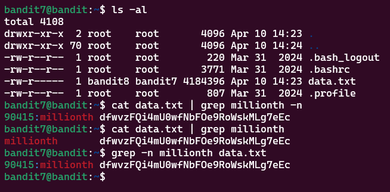

# Bandit Level 7 > 8

## Description:
The password for the next level is stored in the file data.txt next to the word millionth

    owned by user bandit7
    owned by group bandit6
    33 bytes in size

## Tips to help to solve this Level:
man, grep, sort, uniq, strings, base64, tr, tar, gzip, bzip2, xxd

## Solution:
The solution here was to use ```grep``` as this is whats used when looking for patterns. So what I did: 

```bash
grep -n millionth data.txt
```

was I used `grep` and then combined this to show the line number of where the pattern appeared so ```grep -n "pattern"``` so in this case it was ```grep -n millionth``` and then to end it I add the filename so it becomes ```grep -n "pattern" data.txt```. This then came up with the line no, the patterned word that I searched for `millionth` then the password.

The other option which you can use as well is:

```bash
cat data.txt | grep millionth
```

