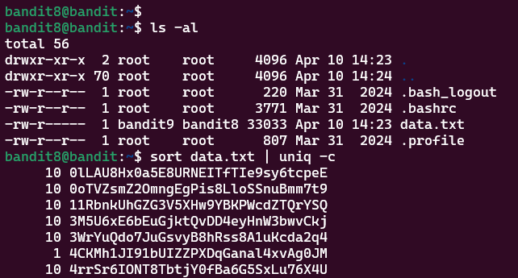

# Bandit Level 8 > 9 


## Description:
The password for the next level is stored in the file data.txt and is the only line of text that occurs only once

## Tips to help to solve this Level:
grep, sort, uniq, strings, base64, tr, tar, gzip, bzip2, xxd

## Solution:
1. Identify the task:
I needed to find the password, which was the unique line of text in the file.

2. Sort the file first:
I used `sort` to arrange all lines in alphabetical (or numerical) order.
This groups together duplicated lines.

```bash
sort filename.txt
```

3. Count duplicates with `uniq -c`:
After sorting, I used `uniq -c` to count how frequently each line appeared.
This lets me identify which password occurs just once.

```bash
sort filename.txt | uniq -c
```

4. Analyze output:
The password is the line that shows up with a count of 1 in the 
output.

