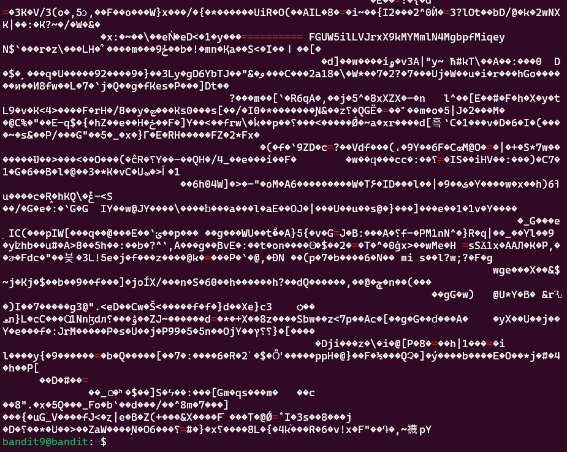

# Bandit Level 8 > 9 

## Description:
The password for the next level is stored in the file data.txt in one of the few human-readable strings, preceded by several ‘=’ characters.

## Tips to help to solve this Level:
grep, sort, uniq, strings, base64, tr, tar, gzip, bzip2, xxd

## Solution:

1. Identify the task:
I needed to search for a password that was marked by a pattern (=) in the file.

2. Initial attempt with grep:
I tried this first:

```bash
grep "pattern" filename.txt
```

But I received a binary file warning or error, stating it did not recognize the file as text.

3. Add -a option to treat it as text:
To work around this, I used:

```bash
grep -a "=" filename.txt
```

The -a (--text) option forced grep to treat the file as text, allowing me to search for the pattern.

4. Analyze output:
The matching lines were highlighted in red, making it easy for me to identify the password.

